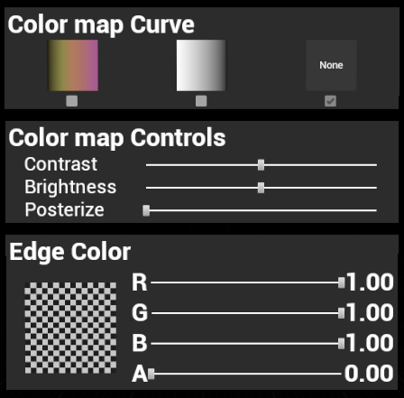
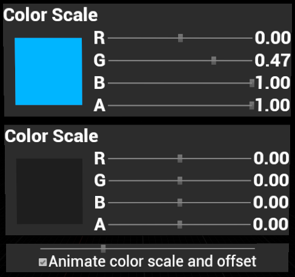

# Passthrough Sample

Different levels are provided for the different features. Always check the Level Blueprint and the widget if any, check VRTPPawn for features common to each level.

## Navigating through the samples

By pressing the Menu button on your left controller you'll open the 'Navigation Menu', where you can see if passthrough is supported on your device, the name and description of the level you're in and a list of levels you can travel to.
Simply aim with your right controller to the level you want and press the right trigger to travel to it. (scroll the list with right thumbstick)


## Passthrough Background with Augmented Objects
A common usage of Passthrough is as a background, where you can place virtual objects (Passthrough AR). You can do this easily, starting from the **PTBackground** scene:

1. Import your FBX or 3D object into your project.
2. Place your object in the scene.
3. Give your object a grab component and set its collision preset to "PhysicsActor" so it can be grabbed and moved around your room.
4. Build & Deploy.

Here are relevant assets in this scene that you can use and modify to fit your needs:

* **Level Blueprint**: Creates and add Passthrough layer to the player pawn
* **BP_OculusLogo.uasset**: A standard actor with lit material.
* **BP_Grafitti.uasset**: This is the same as BP_OculusLogo.uasset but with a custom material.

## Lighting Effects
Darkening your space and lightening it in key areas is another common usage of Passthrough. From shining a top-down spotlight on a table game or art piece, to isolating into a "focus mode" by blacking out everything except your immediate area, or shining a volumetric flashlight paired with dynamic lighting, a lot can be achieved with Passthrough even without scene understanding.

In the **PTLighting** level, you can find an example of using Passthrough to create a "focus mode." The general idea behind lighting Passthrough is:

1. Set Passthrough as an Underlay.
2. Darken the Passthrough using *Color Scale* & *Color Offset*


3. Create another Passthrough Layer component (UserDefined & Underlay, *Texture Opacity Factor* 0, no styling), it will act as the flashlight light cone


4. Project the new layer onto the light cone using the *Add Surface Geometry* node
5. Use the *Set Texture Opacity Node* to turn the flashlight on/off

Here are the relevant assets in this scene that you can use and modify to fit your needs:

* **Level Blueprint**: Creates and add a stylised Passthrough layer to the player pawn
* **BP_Flashlight.uasset**: A flashlight that attach to the right controller and possess a lighted passthrough layer, use Button A to switch on/off.

You can draw a cone with one or multiple meshes. If you use multiple meshes, keep in mind the number of pixels drawn in every frame. Multiple overlapping, blended meshes will often result in many redrawn pixels. Pay careful attention to performance if you use large translucent meshes to simulate a volumetric look.

## Using Passthrough As Overlay
You can see an example of using Passthrough as an overlay in the **PTOpacity** level. In this sample, you use the slider widget (or thumstick on your right controller) to adjust the opacity of the Passthrough layer from 0% to 100%.

Here are relevant assets in this scene that you can use and modify to fit your needs:

* **Level Blueprint**: Creates and add Passthrough layer to the player pawn, sends layer to the widget and binds input for right thumbstick
* **W_PTOpacity.uasset**: Set Texture Opacity based on slider value

## Using Passthrough Styles For Colorful Effects

The **PTStyles** level demonstrates some of the styling options which are available on Passthrough layers. The styling can be controlled using the widget in the level:



* **Color mao Curve**: colorize Passthrough using a predefined curve. The curves are defined in the folder `Content/Passthrough/Data/` and can be customized to achieve different colorizations.
* **Color map Controls**: use the Contrast/Brightness/Posterize sliders to apply image processing effects which are implemented using a color map of type "Grayscale To Color".
* **Edge Color**: use the Red/Green/Blue/Alpha sliders to adjust the color of salient edges in the image (extracted using a Sobel filter).

Here are the relevant assets in this scene that you can use and modify to fit your needs:

* **Level Blueprint**: Creates and adds Passthrough layer to the player pawn, sends layer to the widget
* **BP_Menu.uasset**: The menu actor with the menu widget.
* **W_PTStyler.uasset**: The widget directly modifying the styling of Passthrough

### Color Maps

Instead of specifying color effects via parameters (as demonstrated in the **PTStyles** level), you can define them as an array of 256 values which maps each (grayscale) input value to a new color. This is shown in the level **PTColorMap**.
With the in-game widget you can modify each those 256 values and see the impact on the styling.


Here are the relevant assets in this scene that you can use and modify to fit your needs:

* **Level Blueprint**: Creates and adds Passthrough layer to the player pawn, sends layer to the widget
* **W_PTColorMap.uasset**: The widget for viewing the color map array and editing each of its 256 values

## Color Look-Up Tables (LUTs)

Passthrough can also be colorized using color LUTs. As demonstrated in the **PTColorLut** level you can use two kinds of LUT use type : *Color LUT* and *Interpolated Color LUT*, the second one will take 2 LUTs (source & target) and blend between them using the LUTWeight value.


Here are the relevant assets in this scene that you can use and modify to fit your needs:

* **Level Blueprint**: Creates and adds Passthrough layer to the player pawn, sends layer to the widget
* **W_PTColorLUT.uasset**: The widget for viewing & editing the way the LUTs are used

### Color and Scale Offset

Another way to colorize Passthrough layers is to use color scale and offset.This is illustrated by the **PTColorScaleAndOffset** level, which animate both of those settings.
You can use the in-game widget to stop and edit the color scale and offset



Here are the relevant assets in this scene that you can use and modify to fit your needs:

* **Level Blueprint**: Creates and adds Passthrough layer to the player pawn, sends layer to the widget & animates the color scale and offset
* **W_PTColorScaleAndOffset.uasset**: The widget for viewing and editing the color scale and offset

**Caution**:

The lighting and color in this sample may cause seizures in people with epilepsy or who are sensitive to light and color.

### Passthrough Layer Placement

The **PTLayer_Placement** level shows how placement of Passthrough layers can affect your scene. To change the order of Passthrough layers, use the right trigger to switch the layer between Overlay and Underlay, or use the left trigger to toggle Depth Support.

Here are the relevant assets in this scene that you can use and modify to fit your needs:

* **Level Blueprint**: Creates and adds Passthrough layer to the player pawn, binds inputs and modify layer placement

### Passthrough Masking

The **PTMaskedBrush** and **PTMasking** levels demonstrate experiences where a Passthrough layer is masked and only visible in certain screen areas.
In the **PTMaskedBrush** sample the controller can be used as a brush to draw a projected passthrough stroke by pressing the left and right triggers.
**PTMasking** showcases a circle mesh with masked projected passthrough (using the *mPokeAHoleMask* material) that is attached to the controller which allows you to see your hands (you can change attached controller with left/right trigger)

You can re-use and modify the *mPokeAHoleMask.uasset* material to mask areas in your scene.

Here are the relevant assets in this scene that you can use and modify to fit your needs:

* **Level Blueprint**: Creates and adds Passthrough layer to the player pawn, binds inputs and project passthrough to the circle
* **MaskedCircle**: Actor on which the passthrough is projected, using the *mPokeAHoleMask* material to smooth its border

### Surface-Projected Passthrough

In the **PTSurfaceProjected** level, you can see an example of Passthrough projected onto a mesh surface. Instead of mapping Passthrough to a mesh reconstructed from stereo imagery, this takes an input static mesh and uses the vertex positions to calculate exact stereo mapping. Use this in cases where you have high confidence in real items matching virtual items, such as flat surfaces. For example, the demo scene looks like a TV setup with a view of the real world. Depth accuracy is better with surface-projected Passthrough, especially at longer distances where a reconstructed Passthrough mesh is less reliable.

This feature is also working for procedural meshes as demonstrated in the **PTProceduralMesh** level.
*Note : The Passthrough will not follow mesh modification after it has been added as a Surface Geometry, if you have modified your procedural mesh and want the Passthrough to follow you'll need to remove and add again your mesh*

## How to Use

### Load the project

First, ensure you have Git LFS installed by running this command:
```sh
git lfs install
```

Then, clone this repo using the "Code" button above, or this command:
```sh
git clone https://github.com/oculus-samples/Unreal-PassthroughSample
```

### Launch the project in the Unreal Editor using one of the following options.

#### Epic Games Launcher with MetaXR plugin

The easiest way to get started is to use the prebuilt Unreal Engine from the Epic Games Launcher, with MetaXR plugin.

1. Install the [Epic Games Launcher](https://www.epicgames.com/store/en-US/download)
2. In the launcher, install UE5 (recommended).
3. Download and install the MetaXR plugin from the [Unreal Engine 5 Integration download page](https://developer.oculus.com/downloads/package/unreal-engine-5-integration).
3. Launch the Unreal Editor
4. From "Recent Projects", click "Browse" and select `PTSamples.uproject`

#### Oculus Unreal fork

The Oculus Unreal fork will give you the most up to date integration of Oculus features. However, you must build the editor from its source.

Follow the instructions on [Accessing Unreal Engine source code on GitHub](https://www.unrealengine.com/en-US/ue-on-github) to obtain:
- an Epic account
- a GitHub account
- authorization to access the Unreal Engine source repository
Disregard instructions on downloading Epic’s Unreal Engine source code as you will be building the Oculus-VR fork of Unreal Engine source.

Make sure you have Visual Studio installed properly:
- Launch the Visual Studio Installer and click Modify for the Visual Studio version you want to use.
- Under the Workloads tab, click Game development with C++ if it isn’t checked and then click Modify.

1. Download the source code from the [Oculus-VR fork of Unreal Engine on GitHub](https://github.com/Oculus-VR/UnrealEngine).
2. Follow Epic’s instructions on [Building Unreal Engine from Source](https://docs.unrealengine.com/5.2/en-US/building-unreal-engine-from-source/) to complete the process.

Depending on your machine, the build may take awhile to complete.

# Licenses
The Meta License applies to the SDK and supporting material. The MIT License applies to only certain, clearly marked documents. If an individual file does not indicate which license it is subject to, then the Meta License applies.
